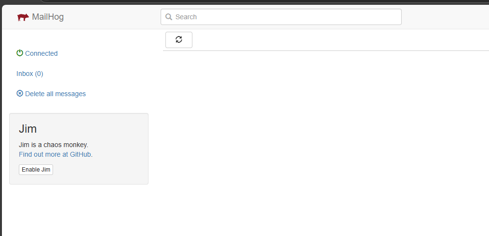

需要在mysql容器中执行
```bash
# Execute the following commands in the MySQL container:
docker exec -it mysql mysql -uroot -p

# Enter the password when prompted:
# Password: PXDN93VRKUm8TeE7

# Then execute the following SQL commands:
USE mysql;
UPDATE user SET host='%' WHERE user='root';
FLUSH PRIVILEGES;
```

邮件测试
```bash
GO111MODULE=on  go install github.com/mailhog/MailHog@latest
```
启动MailHog
```bash
mailhog -smtp-bind-addr 0.0.0.0:11030 -api-bind-addr 127.0.0.1:18026 -ui-bind-addr 127.0.0.1:18026 
```
访问 ` 127.0.0.1:18026 ` 可以看到邮箱界面 